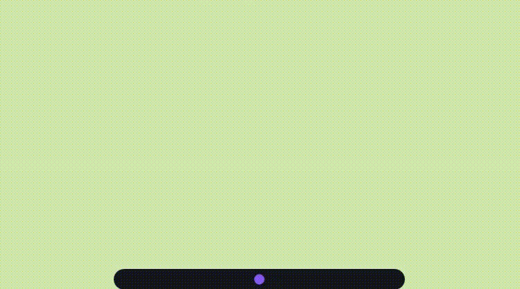

# VibeBar

[English](README.md) | 中文

Windows 悬浮条，Dynamic Island 风格，实时展示所有 Claude Code 会话状态。

悬停展开 — 查看哪些项目在运行、最近问了什么、距今多久。双击卡片跳转到对应 VS Code 窗口，拖拽排序。

<div align="center">
  
</div>

## 功能

- **实时状态圆点** — 紫色脉冲（运行中）、绿色（空闲）、红色（需要关注）、蓝色（后台任务进行中）
- **悬停展开** — 每个会话显示项目名、最近提示词、耗时
- **跳转窗口** — 双击卡片将对应 VS Code 窗口置于前台
- **拖拽排序** — 按优先级排列会话
- **零任务栏占用** — 通过 `SetWindowRgn` 使透明区域鼠标穿透
- **虚拟桌面感知** — 跟随 Windows 虚拟桌面切换

## 依赖

- Windows 10 或 11
- Python 3.9+
- PyQt6（`pip install PyQt6`）
- [Claude Code](https://claude.ai/code)

## 快速上手

```powershell
# 1. 克隆仓库
git clone https://github.com/WWeellkkiinn/vibe-bar.git
cd vibe-bar

# 2. 安装依赖（在有 PyQt6 的 Python 环境中执行）
pip install -r requirements.txt

# 3. 一次性安装
python install.py

# 4. 启动（之后每次双击即可）
# 双击 vibebar.vbs
```

退出方法：在 bar 任意位置**右键双击**。

## install.py 做了什么

1. 检测当前 Python 可执行路径（优先使用 `pythonw.exe`，无控制台窗口）
2. 创建 `%LOCALAPPDATA%\VibeBar\` 状态目录
3. 写入 `.python-path`（gitignored），供 `vibebar.vbs` 读取
4. 向 `%USERPROFILE%\.claude\settings.json` 注入以下 Claude Code hook 事件：

| 事件 | 用途 |
|---|---|
| `SessionStart` | 注册会话，判断主会话 vs 子代理 |
| `UserPromptSubmit` | 标记运行中，记录提示词 |
| `Stop` / `StopFailure` | 标记空闲 |
| `PreToolUse` | 检测 Bash 工具活动（蓝点） |
| `PostToolUse` / `PostToolUseFailure` | 清除 Bash 活动标记 |
| `PermissionRequest` / `Notification` | 红点，需要关注 |
| `PermissionDenied` | 清除关注标记 |
| `SubagentStart` / `SubagentStop` | 追踪后台代理数量（蓝点） |

> `install.py` 幂等，重复运行安全，不会重复添加 hook 条目。

> 如果你已有其他 hook，install.py 只替换 VibeBar 条目，不影响其他配置。

## 调试模式

```powershell
# 带控制台启动，可看到报错
python src/ui_qml.py

# 模拟 hook 事件
echo '{"session_id":"s1","hook_event_name":"SessionStart","cwd":"C:/dev/myproject","model":"claude-opus-4-7"}' | python src/hook.py
echo '{"session_id":"s1","hook_event_name":"UserPromptSubmit","cwd":"C:/dev/myproject","prompt":"修复 bug"}' | python src/hook.py
echo '{"session_id":"s1","hook_event_name":"Stop","cwd":"C:/dev/myproject"}' | python src/hook.py
```

状态文件路径：`%LOCALAPPDATA%\VibeBar\state.json`

## 架构

```
Claude Code → src/hook.py → %LOCALAPPDATA%\VibeBar\state.json → src/ui_qml.py（250ms 轮询）
```

```
vibe-bar/
├── src/
│   ├── hook.py       # Hook 入口 — 读取 stdin JSON，写入 state.json
│   ├── ui_qml.py     # 主进程 — 窗口、worker 线程、state 消费
│   ├── island.qml    # QML UI — 动画、会话卡片、拖拽排序
│   ├── models.py     # SessionsModel + IslandBridge（Python ↔ QML）
│   └── win32.py      # Win32 绑定 — HWND、DWM、SetWindowRgn、显示器
├── install.py        # 一次性安装 — 写入 .python-path + 注入 hooks
├── vibebar.vbs       # 启动器 — 读取 .python-path，静默启动 ui_qml.py
└── .python-path      # （gitignored）本机 Python 路径
```

## 未来计划

- [ ] **Codex CLI 支持** — Codex 作为独立进程运行，不经过 Claude Code hook 系统。追踪其生命周期是计划中的后续功能。

## 许可证

MIT — 见 [LICENSE](LICENSE)。

---

感谢使用 VibeBar！如果它让你的 Claude Code 工作流更顺手，欢迎点个 ⭐ 支持一下。
